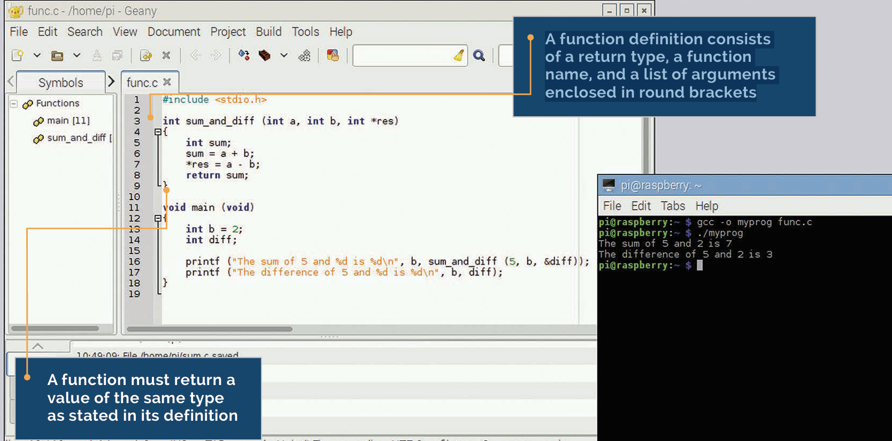
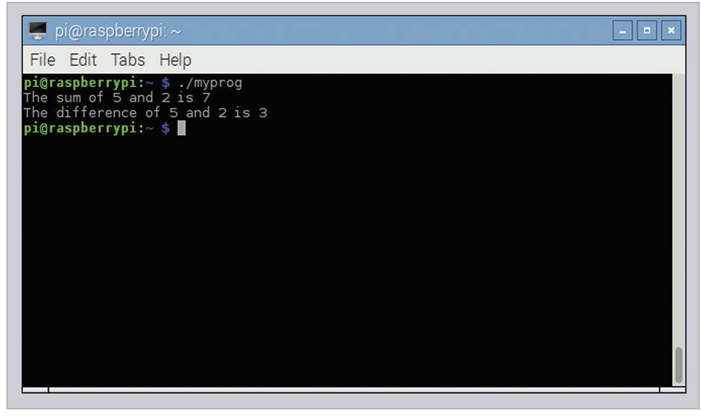
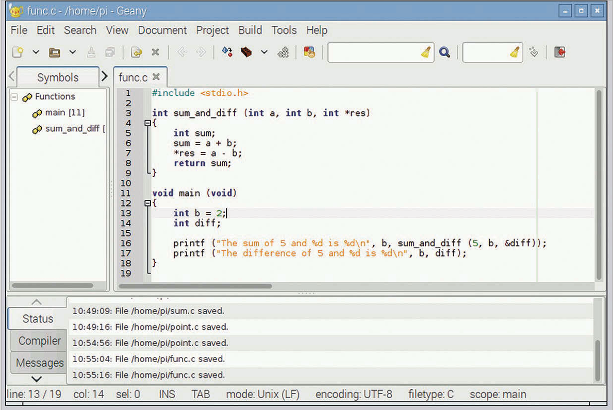

# Functions

A function definition consists of a return type, a function name, and a list of arguments enclosed in round brackets



Up until now, all the examples we’ve looked at have had one single function, main, with all the code in it. This is perfectly valid for small, simple programs, but it’s not really practical once you get more than a few tens of lines, and it’s a waste of space if you need to do the same thing more than once. Splitting code up into separate functions makes it more readable and enables easy reuse. We’ve already seen functions used; the main function is a standard C function, albeit with a special name. We’ve also seen the printf function called by our examples. So how do we create and use a function of our own? Here’s an example:
```c
#include <stdio.h>
int sum (int a, int b)
{
  int res;
  res = a + b;
  return res;
}

void main (void)
{
int y = 2;
  int z = sum (5, y);
  printf ("The sum of 5 and %d is %d\n", y, z);
}
```
## Arguments
A function can have any number of arguments, from zero up to hundreds. If you don’t need any arguments, you list the arguments as (void) in the function definition (just like in the main function); when you call the function, just put a pair of empty round brackets () after the function name.

This includes both the main function and a second function called sum. In both cases, the structure of the function is the same: a line defining the value returned by the function, the function name, and the function arguments, followed by a block of code enclosed within curly brackets, which is what the function actually does.

## What’s in a function? 
Let’s look at the sum function: 

## int sum (int a, int b)

The definition of a function has three parts. The first part is the type of the value returned by the function: in this case, an int. The second part is the name of the function: in this case, sum. Finally, within round brackets are the arguments to the function, separated by commas, and each is given with its type: in this case, two integer arguments, a and b. The rest of the function is between the curly brackets.

## int res;

This declares a local variable for the function, an integer called res. This is a variable which can only be used locally, within the function itself. Variables declared within a function definition can only be used within that function; if you try and read or write res within the main function, you’ll get an error. (You could declare another int called res within the main function, but this would be a different variable called res from the one within the sum function, and would get very confusing, so it’s not recommended!)

## Variable Scope
If you declare a variable within a function, it’s only usable within that function, not within any functions which call the function, or within functions called by the function. This is known as the scope of a variable: the parts of the code in which it’s valid.

## res = a + b;

This should be obvious! Note that a and b are the two defined arguments of the function. When a function is called, a local copy of the arguments is made and used within the function. If you change the values of a or b within the function (which is a perfectly valid thing to do), that only affects the value of a and b within this function; it doesn’t change the values that the arguments had in the function from which it was called.

## return res;

Finally, we need to return the result. The function was defined to return an integer, so it must call the return statement with an integer value to be returned to the calling function. 

A function doesn’t have to return a value; if the return type is set to void, it returns nothing. There’s no need for a return statement in a function with a void return type; the function will return when it reaches the last line; however, if you want to return early (in the event of an error, for example), you just call return with no value after it.

## Calling a function 
Let’s look at how we call the function from main:
```c
int z = sum (5, y);
```
## Returning Values
A function can return a single value, or no value at all. If you define the function as returning void, there’s no need to use a return statement in it, but you’ll get an error if you don’t include a return of the correct type in a non-void function.


The sum function returns an integer, so we set an integer variable equal to it. The arguments we supply to the function are inside round brackets, and in the same order as in the function definition; so in this case, a is 5, and b is the value of y. 

Can you return more than one result from a function? You can only return one value, but you can also use pointers to pass multiple items of data back to the calling function. Consider this example:
```c
#include <stdio.h>
int sum_and_diff (int a, int b, int *res)
{
int sum;
  sum = a + b;
  *res = a – b;
return sum;
}
void main (void)
{
int b = 2;
int diff;
  printf ("The sum of 5 and %d is %d\n", b,  
    sum_and_diff (5, b, &diff));
  printf ("The difference of 5 and %d is %d\n", b, diff);
}
```

We’ve modified the sum function to calculate both the sum and the difference of the arguments. The sum is returned as before, but we’re also passing the difference back using a pointer. Remember that the arguments to a function are local variables; even if you change one in the function, it has no effect on the value passed by the calling function. This is why pointers are useful; by passing a pointer, the function doesn’t change the value of the pointer itself, but it can change the value in the variable to which it’s pointing. 

So we call the function with the same two arguments as before, but we add a third one, a pointer to the variable where we want to write the difference calculated by the function. In the function, we have this line:

## *res = a – b;

The difference is written to the variable to which res is a pointer. In the main function, we call the sum_and_diff function like this:

## sum_and_diff (5, b, &diff)

We provide the address of the integer diff as the pointer argument to the sum_and_diff function; when the difference is calculated, it’s written into the variable diff in the main function.

## Modifying Arguments
Arguments are local variables within a function. If you want a function to modify the arguments you give it, make each argument you want to modify a pointer to a variable; you can then read the value pointed to within the function, and write the changed value back to the same pointer.



By using a pointer as one argument, the sum_and_diff function can return both the sum and difference of the arguments

## Order matters 
One thing to bear in mind when defining functions is that the compiler reads files from top to bottom, and you need to tell it about a function before you can use it. In the examples above, this is automatic, as the definition of the sum and sum_and_diff functions is before the first call to them in main.



A function that returns a value can be used anywhere a variable of that type is expected.
In this code, sum_and_diff(5, b, &diff) returns an integer (the sum), so it can be used directly inside printf as if it were a normal integer variable.

This function does two things:
•	Returns the sum (a + b)
•	Stores the difference (a - b) in *res

A function call can be used like a value if it returns something.

## Step-by-step what happens:
1.	sum_and_diff(5, b, &diff) is called
2.	Inside the function:
o	sum = 5 + b → returned
o	diff = 5 - b → stored via pointer
3.	The returned value (the sum) goes straight into printf

This behaves like an integer value

sum_and_diff(5, b, &diff)

instead of doing this:
int result = sum_and_diff(5, b, &diff);
printf("The sum is %d\n", result);

it does:
printf("The sum is %d\n", sum_and_diff(5, b, &diff));

Function call = value (if it returns something) 
Can use it directly inside printf 
Pointer lets you return extra values 

But in larger files, when multiple functions call multiple other functions, this gets complicated; it’s not always easy to make sure the function definitions are all in the right order. To avoid this, C allows you to declare functions before they are used. A function declaration is just the definition of the function, minus the function code within the curly brackets. So for the sum_and_diff function, the declaration would be:

## int sum_and_diff (int a, int b, int *res);

Note the semicolon at the end! Function declarations are included at the top of the file; when the compiler finds a function declaration, it knows that at some point a function with this name, arguments, and return type will be defined, so it then knows how to handle a call to it, even if it hasn’t yet seen the definition itself.

## Task

[⬅ Lesson 2](Lesson2-Conditions.md) | [🏠 Home](index.md) | [Next ➡ Lesson 4](Lesson4-Input.md)


