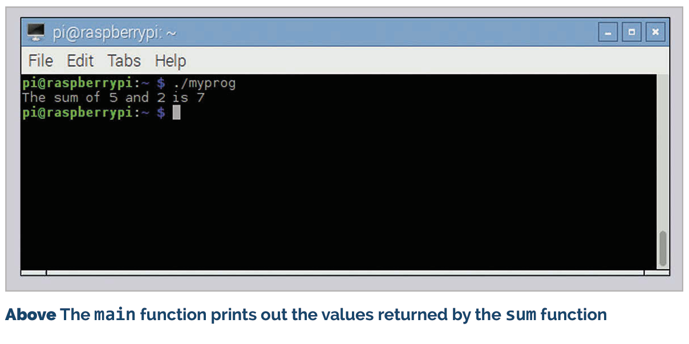

# Functions

A function definition consists of a return type, a function name, and a list of arguments enclosed in round brackets

images/functions.png 

Up until now, all the examples we’ve looked at have had one single function, main, with all the code in it. This is perfectly valid for small, simple programs, but it’s not really practical once you get more than a few tens of lines, and it’s a waste of space if you need to do the same thing more than once. Splitting code up into separate functions makes it more readable and enables easy reuse. We’ve already seen functions used; the main function is a standard C function, albeit with a special name. We’ve also seen the printf function called by our examples. So how do we create and use a function of our own? Here’s an example:
```c
#include <stdio.h>
int sum (int a, int b)
{
  int res;
  res = a + b;
  return res;
}

void main (void)
{
int y = 2;
  int z = sum (5, y);
  printf ("The sum of 5 and %d is %d\n", y, z);
}
```
## Arguments
A function can have any number of arguments, from zero up to hundreds. If you don’t need any arguments, you list the arguments as (void) in the function definition (just like in the main function); when you call the function, just put a pair of empty round brackets () after the function name.

This includes both the main function and a second function called sum. In both cases, the structure of the function is the same: a line defining the value returned by the function, the function name, and the function arguments, followed by a block of code enclosed within curly brackets, which is what the function actually does.

## What’s in a function? 
Let’s look at the sum function: 

## int sum (int a, int b)

The definition of a function has three parts. The first part is the type of the value returned by the function: in this case, an int. The second part is the name of the function: in this case, sum. Finally, within round brackets are the arguments to the function, separated by commas, and each is given with its type: in this case, two integer arguments, a and b. The rest of the function is between the curly brackets.

## int res;

This declares a local variable for the function, an integer called res. This is a variable which can only be used locally, within the function itself. Variables declared within a function definition can only be used within that function; if you try and read or write res within the main function, you’ll get an error. (You could declare another int called res within the main function, but this would be a different variable called res from the one within the sum function, and would get very confusing, so it’s not recommended!)

## Variable Scope
If you declare a variable within a function, it’s only usable within that function, not within any functions which call the function, or within functions called by the function. This is known as the scope of a variable: the parts of the code in which it’s valid.

## res = a + b;

This should be obvious! Note that a and b are the two defined arguments of the function. When a function is called, a local copy of the arguments is made and used within the function. If you change the values of a or b within the function (which is a perfectly valid thing to do), that only affects the value of a and b within this function; it doesn’t change the values that the arguments had in the function from which it was called.

## return res;

Finally, we need to return the result. The function was defined to return an integer, so it must call the return statement with an integer value to be returned to the calling function. 

A function doesn’t have to return a value; if the return type is set to void, it returns nothing. There’s no need for a return statement in a function with a void return type; the function will return when it reaches the last line; however, if you want to return early (in the event of an error, for example), you just call return with no value after it.

## Calling a function 
Let’s look at how we call the function from main:
```c
int z = sum (5, y);
```
## Returning Values
A function can return a single value, or no value at all. If you define the function as returning void, there’s no need to use a return statement in it, but you’ll get an error if you don’t include a return of the correct type in a non-void function.




