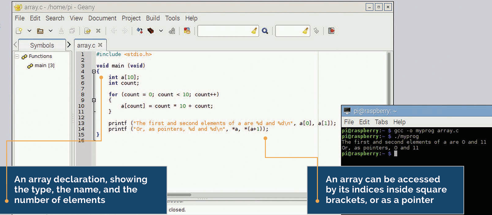
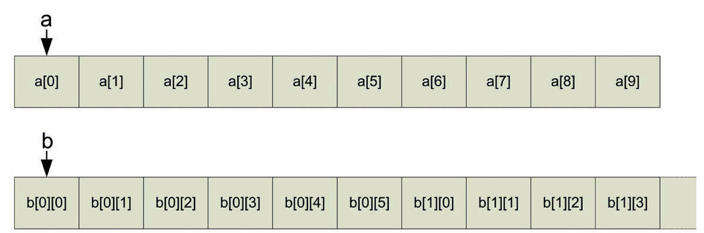

# Arrays



The variables we have looked at so far are all single numeric values. In this chapter, we’re going to look at how C handles lists of values, and that leads into using lists of letters to store and manipulate text strings. 

An array is a single variable which stores multiple different values of the same type; the individual values are accessed by indexing the array. An array can have one or more dimensions; a one-dimensional array is a single list of values, while a two-dimensional array is a list of lists of values, and so on. An array is declared in C by putting the size of each dimension in square brackets after the variable name. So

```c
int a [10];
is a list of 10 integers, while
int b[5][6];
```
is a list of 5 lists, each of which contains 6 integers. When accessing the elements inside an array, the array index - the number inside the bracket - starts at 0. So the 10 integers contained within array **a** above are referred to as **a[0], a[1], a[2]** and so on up to **a[9]**. The compiler will quite happily allow you to read or write **a[10], a[11]** or indeed **a[any number you like]**, but these are all outside the memory which was allocated when the array was declared, so writing to them is a really bad idea!

## Arrays and Pointers
This brings us on to the relationship between pointers and arrays. The name of an array is effectively a pointer to the first element of the array. Remember that a pointer is the address of a variable in memory? Well, an array is a contiguous block of memory which contains all the elements of the array in order, so you can use a pointer to access it. (In fact, even if you use values in square brackets to access it, the compiler treats those as a pointer anyway.) Here’s an example:

```c
void main (void)
{
    int a[10];
    int count;
    for (count = 0; count < 10; count++)
{
        a[count] = count * 10 + count;
}
      printf ("The first and second elements of a are %d and %d\n",  
      a[0], a[1]);
      printf ("Or, as pointers, %d and %d\n", *a, *(a+1));
}
```
This fills the 10 values of **a** with the numbers 0, 11, 22, 33, and so on, and then reads **a[0] and a[1]**. It then reads the same values using **a** as a pointer, and you can see if you run the code that they are identical. 

With a two-dimensional array or greater, you need to consider how the compiler arranges the dimensions in memory; it does so by grouping the elements at the rightmost index of the array together. With the array **b[5][6]** above, **b** itself points at **b[0][0]**. **b+1** points at **b[0][1];** **b+5** points at **b[0][5];** and **b+6** points at **b[1][0]**. You can initialise an array at the same time as you declare it by putting the values in curly brackets, so:
```c
int a[10] = { 0, 11, 22, 33, 44, 55, 66, 77, 88, 99 };
```
But note that this only works when the array is first declared; once it exists, you can’t use this shortcut and will need to iterate through the array indices, setting each value in turn.



Above Array elements are stored sequentially in memory, with the array name a pointer to the first element. Multi-dimensional array elements are stored with the elements with neighbouring values, in the rightmost index next to each other.

## Names are pointers
Remember that the name of an array or a string is just a pointer to the first element of the array or string in question, and can be used in the same way as any other pointer; it can be incremented and decremented, or dereferenced to find the value to which it points.

## Keep inside your array
One of the biggest sources of crashes and bugs in C is creating an array and then writing past the end of it. The compiler won’t stop you writing to memory off the end of an array, and doing so can have serious consequences. Always make sure your array indices fit inside your array.


