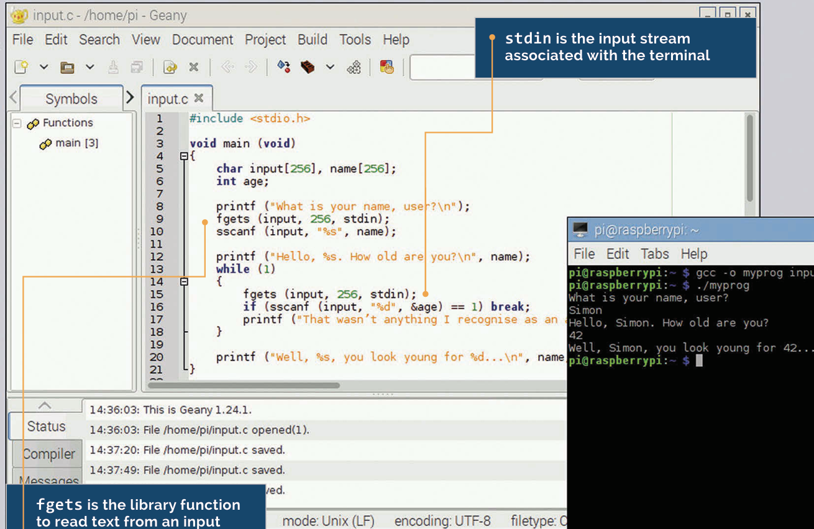

# User Input



To print a program output to the terminal, the program needs to interact with the user, this needs to be a two-way process. This lesson looks at how we can read and interpret input that the user enters in the terminal. We’ve seen the **printf** function used a lot in previous chapters; it’s the standard way of writing formatted text output from a program to the console, the command line from which you run the program. But what if you want to get input from the user? How do we read what the user types into the console? 

In the last lesson, we looked at the **sscanf** function which reads values from a string. There’s an equivalent function called **scanf**, which reads values directly from the console, as in the following example

```c
#include <stdio.h>
void main (void)
{
char input[256];
int age;
  printf ("What is your name, user?\n");
  scanf ("%s", input);
  printf ("Hello, %s. How old are you?\n", input);
  scanf ("%d", &age);
  printf ("Well, %s, you look young for %d...\n", input, age);
}
```
scanf works exactly like sscanf, but has one fewer argument, as it reads from the console rather than from a string. However, it’s not really the best way of getting console input; it only really works if you have a user who types in exactly what you expect. Unfortunately, users have a nasty tendency to type in things you aren’t expecting, and scanf doesn’t cope well with this. 

For example, in the code above, if the user types in 257 characters when asked for their name, they will overflow the space allocated for the input string, and bad things may happen..

## A better way
A better approach is to read each line the user enters into a buffer string, and then use sscanf to read values from that string. The C library function fgets is useful for this. Have a look at this example:
```c
#include <stdio.h>
void main (void)
{
    char input[256], name[256];
    int age;
    printf ("What is your name, user?\n");
    fgets (input, 256, stdin);
    sscanf (input, "%s", name);
    printf ("Hello, %s. How old are you?\n", name);
    while (1)
{
        fgets (input, 256, stdin);
        if (sscanf (input, "%d", &age) == 1) break;
        printf ("I don't recognise that as an age - try again!\n");
}
    printf ("Well, %s, you look young for %d...\n", name, age);
}

```
**fgets** takes three arguments. The first is the buffer into which it should store the input. The second is the maximum number of bytes it will write into that buffer; this is useful to prevent the overflow situation mentioned above. Finally, it takes an argument telling it where to read from; in this case, this is set to **stdin** (short for ‘standard input’), which tells it to read from the console. 

So each time we ask the user for input, we use **fgets** to read up to 256 characters of whatever they type (up to the point at which they press the enter key), and we then use **sscanf** to interpret it. Additionally, when asking for the user’s age, we use the value returned by **sscanf** to check that the user has entered what you expect, and loop until they give a valid answer. You can use this method to interpret pretty much anything a user types, and to safely handle all the cases where they type something unexpected!

## Reading parameters
There’s another way to get input to your program, which is to supply it as a parameter when you start the program from the command line. I’ve always shown the definition of the main function as 
```c
void main (void)
```
This works, as you’ve seen, but it isn’t strictly correct. The strict definition of main looks like this:

```c
int main (int argc, char *argv[])
```
So what does it all mean? First off, we can see that **main** returns an integer; this is a success or failure code which some operating systems can use for processing in a shell script or the like. Traditionally, if a program succeeds, **main** returns 0, and if it fails, it returns a non-zero error code. For programs that run on their own, you really don’t need to worry about it! What’s more useful are the other two arguments. **argc** is an integer, and this is the number of parameters which were provided on the command line when the program was started. 

Strangely, the number includes the program name itself, so this value is always 1 or more; if parameters were provided, it will be 2 or more. **char *argv[];** now that’s confusing, right? This is actually a composite of a few things we’ve already seen. There’s a * in there, so it’s a pointer; the type is **char**, so there are characters in it, and there are square brackets, so it’s an array... This is actually an array of pointers to characters; each element of the array is a string, and each string is one of the parameters provided to the program.

It’s probably easier to understand that in practice:
```c
#include <stdio.h>
int main (int argc, char *argv[])
{
int param = 0;
while (param < argc)
  {
    printf ("Parameter %d is %s\n", param, argv[param]);
    param++;
  }
return 0;
}
```
Try running this as before, just by typing its name. Then try typing other things after the name on the command line and see what the program prints.

IMAGE

The argc and argv arguments to the main function can be used to access parameters typed on the command line when the program is run

## Get the number right
Remember that the first item in the argv array - argv[0] - is the name of the program itself, not the first parameter. The actual parameters start at argv[1].

Here’s an example of a (very) simple calculator written using program parameters:
```c
#include <stdio.h>
int main (int argc, char *argv[])
{
    int arg1, arg2;
    if (argc == 4)
  {
        sscanf (argv[1], "%d", &arg1);
        sscanf (argv[3], "%d", &arg2);
        if (*argv[2] == '+') printf ("%d\n", arg1 + arg2);
        if (*argv[2] == '-') printf ("%d\n", arg1 - arg2);
        if (*argv[2] == 'x') printf ("%d\n", arg1 * arg2);
        if (*argv[2] == '/') printf ("%d\n", arg1 / arg2);
  }
  return 0;
}

```
Note that we use ***argv[2]** to get the first character of the second parameter. This should only ever be a single character, but because each of the arguments can be a string, **argv[2]** (without the asterisk) is a pointer to a character, not the single character required for a comparison using **==**. 

Make sure you separate the arguments from the operator with spaces so they’re identified as separate parameters; **<program> 2 + 2** rather than **<program> 2+2**

IMAGE
The calculator reads the two values and the operator from the argv array and prints the result

## Checking return values
In Linux, the return value from a program isn’t shown, but is stored and can be read from the command line. If you type echo $? immediately after running a program, the value the program returned will be shown. Return values are mainly useful if you’re calling programs from scripts.

## STDIN and STOUT
We talk about stdin in this article, which is the ‘standard input’ stream: what the user types at the console. You may sometimes see references to stdout, which is the ‘standard output’ stream - as you might expect, this is output which is printed to the console, usually via printf.

## SCANF
Just like sscanf, scanf returns an integer indicating how many values it successfully read, which you can use to check for errors. One problem is that scanf only removes matched values from the input buffer, so if a scanf fails to match anything, what the user typed will be read again on the next call to scanf. It really is easier to use fgets and sscanf!


